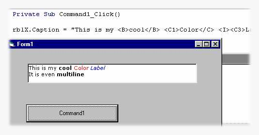



## RichLabel : this is to the normal label, what RichTextBox is to the TextBox\!

### Description

RichLabel: (formerly ColorLabel)

this is to the normal label, what RichTextBox is to the TextBox! check out the screenshot to see what i mean, and don't forget to visit my webpage for quality codes:

geocities.com/mdsy_2000
 
### More Info
 

             |
---                |---
**Submitted On**   |2002-03-03 03:46:52
**By**             |[M\. J\. Highlander](https://github.com/Planet-Source-Code/PSCIndex/blob/master/ByAuthor/m-j-highlander.md)
**Level**          |Intermediate
**User Rating**    |4.5 (18 globes from 4 users)
**Compatibility**  |VB 6\.0
**Category**       |[Custom Controls/ Forms/  Menus](https://github.com/Planet-Source-Code/PSCIndex/blob/master/ByCategory/custom-controls-forms-menus__1-4.md)
**World**          |[Visual Basic](https://github.com/Planet-Source-Code/PSCIndex/blob/master/ByWorld/visual-basic.md)
**Archive File**   |[RichLabel\_58938322002\.zip](https://github.com/Planet-Source-Code/m-j-highlander-richlabel-this-is-to-the-normal-label-what-richtextbox-is-to-the-textbox__1-32279/archive/master.zip)

